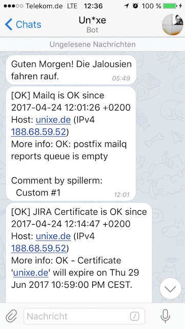

# Notification by Telegram
Sending Icinga 2 notifications via Telegram!

Special thanks to contributing [steadfasterX](https://github.com/steadfasterX) and [Tom](https://github.com/Thomas-Gelf) :-)


## Preparing
### Create your bot



Obviously you need a bot to begin:

Follow the [official Telegram guide](https://core.telegram.org/bots) and do not forget to grab your bot `API TOKEN` (referred to here as `BOTTOKEN`) afterwards

### Get your chat_id(s)

You can notify a specific TG user account or throw a message to a TG group.

In order to do so you need to know the corresponding (hidden) ID also called `chat_id` (`-q TELEGRAM_CHATID`).

If you want to notify a **group/channel**:

1. Add your bot to that group/channel
1. Send with your favorite client a simple mention msg to your bot (e.g. `hi @mybot`)
1. Catch updates for your bot:
`curl https://api.telegram.org/bot<BOTTOKEN>/getUpdates`
1. Review the output, an example below:
   > "message":{"message_id":91, "from":{"id":123456789, "is_bot":false,"first_name":"foo","username":"foobar","language_code":"de"}, "chat":{"id":-987654321, "title":"<GROUPNAME>","type":"group","all_members_are_administrators":true},"date":1563547428,"group_chat_created":true}}]}`

    There are 2 important parts here:
     - a) `"from":{"id":123456789` which is the unique user/chat_id of the user who sends a message to your bot (required to send to a notify to that person directly)
     - b) `"chat":{"id":-987654321` which is the unique group/channel id of the group where the message has been sent

If you do not want to notify a group i.e. just **a direct user notification**:

1. Do the same as above, just at step 1 make a direct message to your bot instead
1. As you have done a direct message you will only get a "from" id which is all you need here

## Examples

### Testing a notification

Sending a test notification – replace the token, botname and chat id obviously.

```
sudo -u nagios ./service-by-telegram.sh -4 127.0.0.1 \
-l myhostname \
-o testingTGnotifiy \
-p <myBotname> \
-q <myGroupChatId> \
-r "<1234134325:blafasel>" \
-s CRITICAL \
-c mycomment \
-b mycommentuser \
-i https://myicingaserver/icingaweb2 \
-n maaaaaaaaaaa \
-d"$(date +%F-%T)" \
-e serviceshort \
-u fullservicename \
-D
```

### Icinga2 objects
#### Example host objects
<details>
   <summary>Example host template</summary>

```ini
template Host "Generic Host Template" {
  check_command = "hostalive"
  max_check_attempts = "3"
  check_interval = 1m
  retry_interval = 1m
  check_timeout = 30s
  enable_notifications = true
  enable_active_checks = true
  enable_passive_checks = true
  enable_event_handler = true
  enable_flapping = true
  enable_perfdata = true
  volatile = false
  vars.notification_type = "Telegram"
}
```
</details>

<details>
   <summary>Example host object</summary>
      
```ini
object Host "icinga2-master" {
    import "Generic Host Template"
    address = "127.0.0.1"
}

```
</details>

#### Example user templates
<details>
   <summary>Generic user template</summary>

```ini
template User "Generic User Template" {
    enable_notifications = true
}
```
</details>

<details>
   <summary>User "telegram_bot"</summary>

```ini
object User "telegram_bot" {
    import "Generic User Template"

    display_name = "Bot via Telegram"
    email = "you@yourdomain.tld"
    states = [ Critical, Down, OK, Unknown, Up, Warning ]
    types = [ Custom, Problem, Recovery ]
}
```
</details>

#### Example command definitions
<details>
   <summary>Notification Command: Hosts by Telegram</summary>

```ini
object NotificationCommand "Notify Host By Telegram" {
    import "plugin-notification-command"
    command = [ "/etc/icinga2/scripts/host-by-telegram.sh" ]
    arguments += {
        "-4" = {
            required = true
            value = "$address$"
        }
        "-6" = "$address6$"
        "-b" = "$notification.author$"
        "-c" = "$notification.comment$"
        "-d" = {
            required = true
            value = "$icinga.long_date_time$"
        }
        "-i" = "$icingaweb2url$"
        "-l" = {
            required = true
            value = "$host.name$"
        }
        "-n" = "$host.display_name$"
        "-o" = {
            required = true
            value = "$host.output$"
        }
        "-p" = {
            required = true
            value = "$telegram_bot$"
        }
        "-q" = {
            required = true
            value = "$telegram_chatid$"
        }
        "-r" = {
            required = true
            value = "$telegram_bottoken$"
        }
        "-s" = {
            required = true
            value = "$host.state$"
        }
        "-t" = {
            required = true
            value = "$notification.type$"
        }
        "-v" = "$telegram_notification_logtosyslog$"
    }
}
```
</details>

<details>
   <summary>Notification Command: Services by Telegram</summary>

```ini
object NotificationCommand "Notify Service By Telegram" {
    import "plugin-notification-command"
    command = [ "/etc/icinga2/scripts/service-by-telegram.sh" ]
    arguments += {
        "-4" = {
            required = true
            value = "$address$"
        }
        "-6" = "$address6$"
        "-b" = "$notification.author$"
        "-c" = "$notification.comment$"
        "-d" = {
            required = true
            value = "$icinga.long_date_time$"
        }
        "-e" = {
            required = true
            value = "$service.name$"
        }
        "-i" = "$icingaweb2url$"
        "-l" = {
            required = true
            value = "$host.name$"
        }
        "-n" = "$host.display_name$"
        "-o" = {
            required = true
            value = "$service.output$"
        }
        "-p" = {
            required = true
            value = "$telegram_bot$"
        }
        "-q" = {
            required = true
            value = "$telegram_chatid$"
        }
        "-r" = {
            required = true
            value = "$telegram_bottoken$"
        }
        "-s" = {
            required = true
            value = "$service.state$"
        }
        "-t" = {
            required = true
            value = "$notification.type$"
        }
        "-u" = {
            required = true
            value = "$service.display_name$"
        }
        "-v" = "$telegram_notification_logtosyslog$"
    }
}
```
</details>

#### Example notification objects
<!-- NOTIFICATION TEMPLATE TELEGRAM GENERIC -->
<details>
   <summary>Notification Template: Telegram Generic</summary>

```ini
template Notification "Template: Telegram (Generic)" {
    vars.telegram_bot = "<YOUR_TELEGRAM_BOT_NAME>"
    vars.telegram_bottoken = "<YOUR_TELEGRAM_BOT_TOKEN>"
    vars.telegram_chatid = "<YOUR_TELEGRAM_CHAT_ID>"
    vars.telegram_notification_logtosyslog = true
}
```
</details>

<details>
   <summary>Notification Template: Host Notifications</summary>
   
```ini
template Notification "Template: Host Notifications via Telegram" {
    import "Template: Telegram (Generic)"

    command = "Notify Host By Telegram"
    interval = 1h
}
```
</details>

<details>
   <summary>Notification Template: Service Notifications</summary>
   
```ini
template Notification "Template: Service Notifications via Telegram" {
    import "Template: Telegram (Generic)"

    command = "Notify Service By Telegram"
    interval = 4h
}
```
</details>


#### Example notification apply rules
<details>
   <summary>Apply rule for host notifications</summary>
 
```ini
   apply Notification "Host Alert via @telegram_bot" to Host {
    import "Template: Host Notifications via Telegram"

    interval = 1h
    assign where host.vars.notification_type == "Telegram"
    states = [ Down, Up ]
    types = [ Custom, Problem, Recovery ]
    users = [ "telegram_bot" ]
}
```
</details>

<details>
   <summary>Apply rule for service notifications</summary>
   
```ini
apply Notification "Service Alerts via @telegram_bot" to Service {
  import "Template: Service Notifications via Telegram"

  interval = 12h
  assign where host.vars.notification_type == "Telegram"
  users = [ "telegram_bot" ]
}
```
</details>


#### Example Director screenshot
<details>
   <summary>Notifications by Telegram via Icinga Director</summary>
   

</details>

#### Related Director Baskets
* [Just the Commands](contrib/Director-Basket_Telegram_Commands.json)
* [Commands and Notification Templates with fields](contrib/Director-Basket_Telegram_Notifications.json)
  (requires Director v1.8.0 or a master newer than [80f9ea2])(https://github.com/Icinga/icingaweb2-module-director/commit/80f9ea2)
